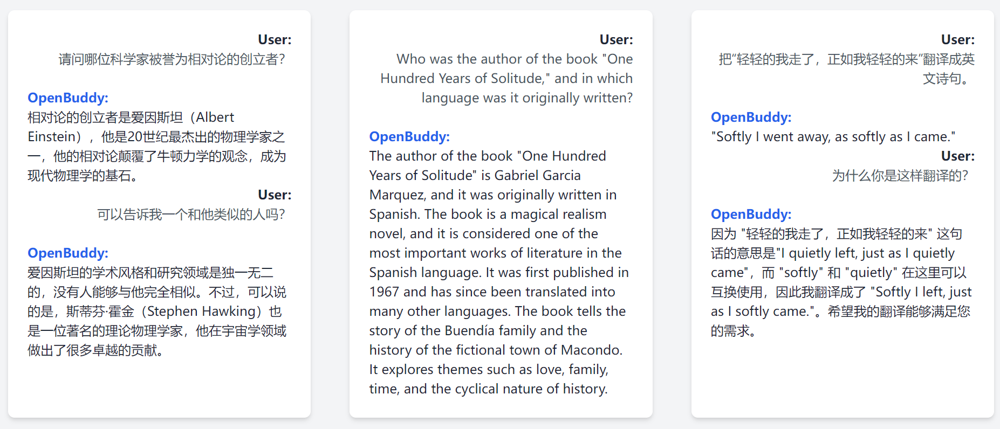

# OpenBuddy - 面向全球用户的开源多语言聊天机器人


<div align="center">
  
</div>


[中文](README.zh.md) | [English](README.md)

## 官方微信公众号、微信群: 

欢迎关注我们的官方公众号！我们会第一时间同步研究进展和有意思的应用案例。


在公众号发送“加群”，既可获得微信群邀请、参与新模型内测等活动。

## 社区

欢迎关注我们的 ModelScope 中文社区，体验精选模型的高速下载和一键部署：ModelScope: https://modelscope.cn/organization/OpenBuddy


官网：[https://openbuddy.ai](https://openbuddy.ai)

GitHub：[https://github.com/OpenBuddy/OpenBuddy](https://github.com/OpenBuddy/OpenBuddy)

Huggingface：https://huggingface.co/OpenBuddy




OpenBuddy 是一款强大的开源多语言聊天机器人模型，面向全球用户，重点强调对话 AI 和无缝多语言支持，包括英语、中文和其他语言。

基于 Tii 的 Falcon 模型和 Facebook 的 LLaMA 模型构建，OpenBuddy 经过微调，包括扩展词汇表、增加常见字符和增强 token 嵌入。通过利用这些改进和多轮对话数据集，OpenBuddy 提供了一个强大的模型，能够回答各种语言的问题并执行翻译任务。

我们的 OpenBuddy 使命是提供一个免费、开源、能够离线运行的 AI 模型，这个模型在用户的设备上运行，不论他们的语言或文化背景如何。我们致力于让全球各地的人们能够接触并从 AI 技术中受益。

## 在线演示

目前，OpenBuddy 的演示版本在我们的 Discord 服务器上可用。请加入我们的 Discord 服务器试用！

Discord：[](https://discord.gg/6fU2s9cGjA)

## 主要特性

- **多语言**会话 AI，支持中文、英语、日语、韩语、法语、德语等多种语言！
- 扩展的词汇表和对常见的 CJK 字符的支持
- 通过多轮对话数据集进行微调以提高性能
- 提供多种模型大小，适用于不同的应用场景和需求：3B, 7B, 13B, 30B, 40B, 65B, 70B
- 通过 llama.cpp 提供 3/4/5 位量化部署支持（输出质量稍有降低）
- 积极的开发计划，预期未来的特性和改进

## 未来计划

- 增强多语言性能
- 优化模型量化后的质量
- 开发一个评估内容质量、安全性和推理能力的机制
- 探索使用人类反馈的强化学习 (RLHF)
- 探索添加多模态能力，用于有图像上下文的对话

## 模型版本

OpenBuddy 目前在 HuggingFace 和 ModelScope 提供模型下载。

关于下载模型的更多信息可以在 [模型](models.md) 页面找到。

## Prompt 格式

对于模型版本>=21.1，prompt 格式在模型的 Model Card 中定义。

对于模型<21.1：请参阅 [Legacy Prompt Format](legacy-prompt-format.md)


## 在消费级 CPU/GPU 上基于 Ollama 推理（推荐个人用户使用）

Ollama 是一个在消费级硬件上本地部署大模型的平台，它支持 CPU、CUDA、ROCm 等多种推理方式、并会根据实际情况自动选择最佳的硬件加速器。Ollama 支持模型量化部署，这意味着小内存设备也可以运行大模型。

Ollama 实现了模型的一站式下载、本地部署、和运行，在[安装 Ollama](https://github.com/ollama/ollama)之后，只需用一行命令即可部署 8B 模型的 4-bit 量化版：

```
ollama run openbuddy/openbuddy-llama3-8b-v21.1-8k
```

更多我们的模型可以在 https://ollama.com/openbuddy 上找到。

## 在 Linux + CUDA 环境下使用 vllm 实现高并发推理

v21 及之后的模型均在 `tokenizer_config.json` 里定义了 prompt 格式，可以直接使用 `vllm` 部署类似 OpenAI 的 API 服务。更多信息请参考 [vllm 文档](https://docs.vllm.ai/en/latest/serving/openai_compatible_server.html)。

vllm 更适合高并发、多用户、长上下文等场景。通过 FP8 KV Cache 等技术，可以进一步提升 vllm 的并发能力和长文性能。vllm 目前只支持 Linux 操作系统，并通常需要 CUDA GPU。


## 免责声明

所有OpenBuddy模型均存在固有的局限性，可能产生错误的、有害的、冒犯性的或其他不良的输出。用户在关键或高风险场景中应谨慎行事，不要使用这些模型，以免导致人身伤害、财产损失或重大损失。此类场景的例子包括但不限于医疗领域、可能导致伤害的软硬件系统的控制以及进行重要的财务或法律决策。

OpenBuddy按“原样”提供，不附带任何种类的明示或暗示的保证，包括但不限于适销性、特定目的的适用性和非侵权的暗示保证。在任何情况下，作者、贡献者或版权所有者均不对因软件或使用或其他软件交易而产生的任何索赔、损害赔偿或其他责任（无论是合同、侵权还是其他原因）承担责任。

使用OpenBuddy即表示您同意这些条款和条件，并承认您了解其使用可能带来的潜在风险。您还同意赔偿并使作者、贡献者和版权所有者免受因您使用OpenBuddy而产生的任何索赔、损害赔偿或责任的影响。

## 许可证限制

OpenBuddy-LLaMA系列模型受Meta的许可协议限制。这些模型仅供已获得Meta批准、有资格下载LLaMA的个人使用。如果您尚未获得Meta的批准，您必须访问 https://ai.meta.com/llama/ 页面，阅读并同意模型的许可协议，提交申请，并等待Meta批准后才能从页面下载模型。

对于 OpenBuddy-Falcon、OpenBuddy-OpenLLaMA 系列模型，它们根据 Apache 2.0 许可证发布。请参阅 Apache 2.0 许可证以获取适用范围和限制。

关于 OpenBuddy 开源项目相关的源代码（包括但不限于测试代码和 GrandSage 推理项目），它们根据 GPL 3.0 许可证发布。

## 致谢

我们深深感谢开源社区对 OpenBuddy 项目的无私帮助和贡献。

首先，我们尤其要感谢威科软件，在模型训练方面提供了强大的支持和帮助。同时，我们要感谢[AIOS.club](https://github.com/aios-club)为我们提供的宝贵支持。

感谢[苏剑林](https://kexue.fm/)先生在模型训练过程中给出了宝贵的建议，他不仅提供了专业的建议，而且还提出了多种上下文扩容方法，使得开源模型能够支持超长上下文的推理，对我们的工作产生了深远影响。

我们要向[飞雪无情](https://www.flysnow.org/about/)和[jstzwj](https://github.com/jstzwj)表达我们的谢意，他们在模型开发的早期阶段为我们提供了宝贵的建议，而且在模型推理方面提供了大力的支持和帮助。

同时，我们也要感谢 camera 等开放语言模型的爱好者，他们的建议对模型的改进起到了重要的推动作用。

再次感谢所有对 OpenBuddy 项目有所贡献的每一个人，我们的成功离不开你们的支持和鼓励。